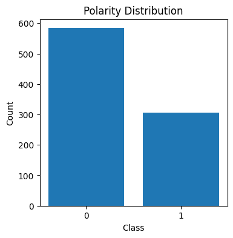
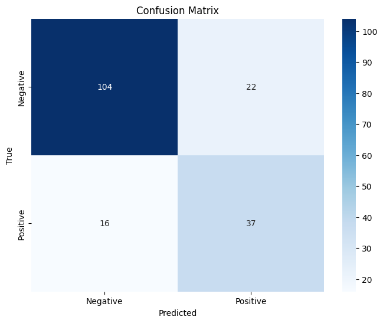

# NLP Assignment - Part1

This repository contains solutions for an assignment on Natural Language Processing (NLP). The assignment is divided into four main questions, each addressed by a separate Python file. Below, you will find a brief description of each file and its functionality.

## Files in this Repository

### 1. Implementing Custom Tokenizer

This [file](NLP_CA1_Q1.ipynb) involves creating a custom tokenizer using regular expressions.

### 2. GPT Vs. BERT Tokenizers

This [file](NLP_CA1_Q2.ipynb) focuses on tokenizers used in large language models like BERT and GPT.

### 3. Implementing N-grams

This [file](NLP_CA1_Q3.ipynb) involves building n-gram language models and generating text.

### 4. Sentiment Analysis with Ngrams

This [file](NLP_CA1_Q4.ipynb) is focusing on sentiment analysis using n-gram models.

**Plots:**

* **Data Distribution:**



* **Confusion Matrix:**




## How to Run

To run any of the notebooks, follow these steps:

1. Ensure you have Jupyter Notebook installed. You can install it using the following command:

   ```bash
   pip install notebook
   ```

2. Clone this repository to your local machine:

   ```bash
   git clone https://github.com/m-salmani78/NLP-Assignments-Part1.git
   
   ```

3. Navigate to the directory containing the notebooks:

   ```bash
   cd <repository-directory>
   ```

4. Launch Jupyter Notebook:

   ```bash
   jupyter notebook
   ```

5. In the Jupyter Notebook interface, open the desired `.ipynb` file to view and run the code cells.


## Dependencies

The following Python libraries are required to run the scripts:

- `nltk`
- `pandas`
- `scikit-learn`
- `re`
- `collections`

You can install these dependencies using pip:

```bash
pip install nltk pandas scikit-learn
```
